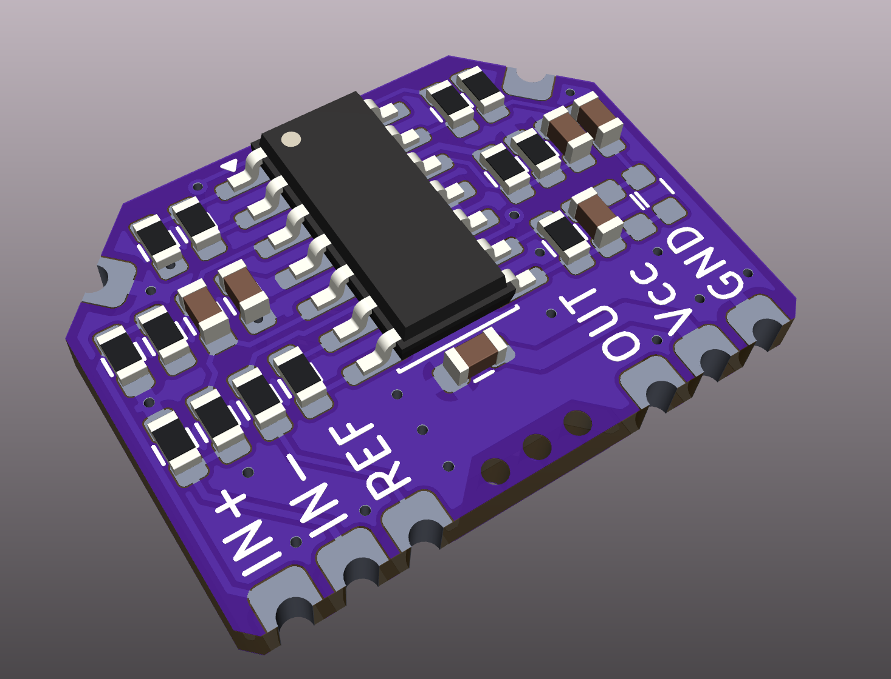
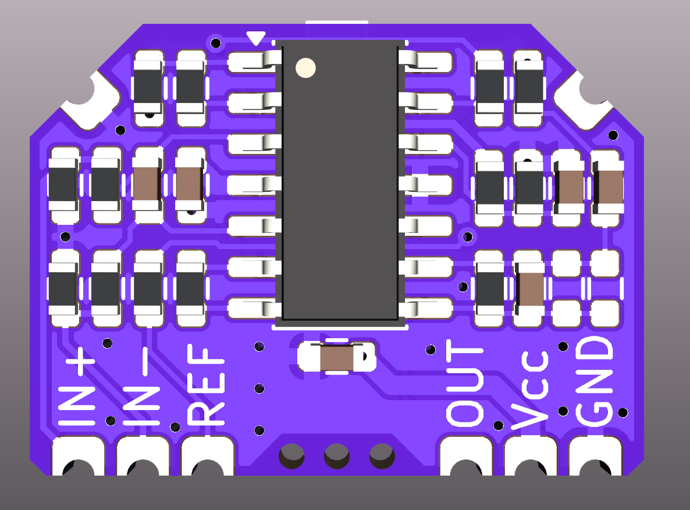
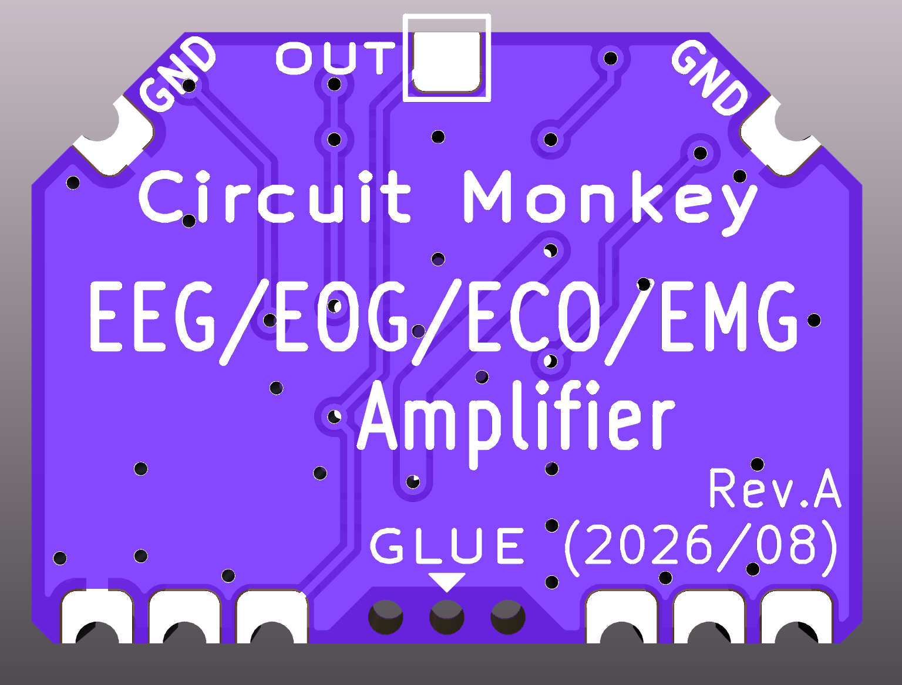
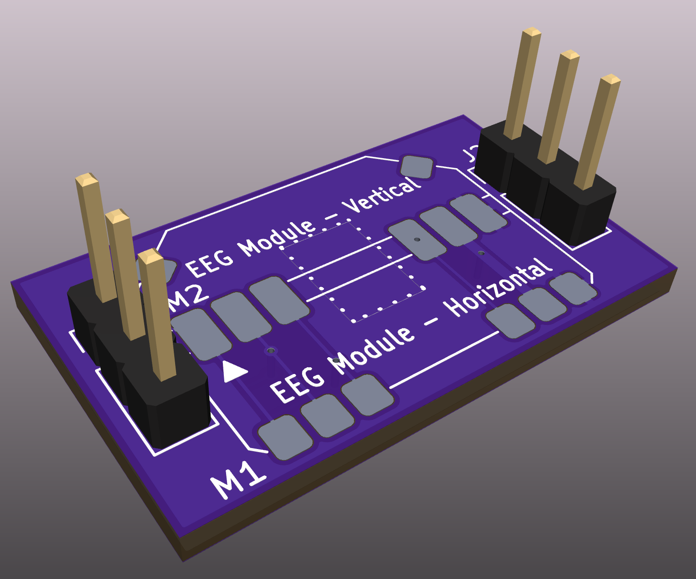
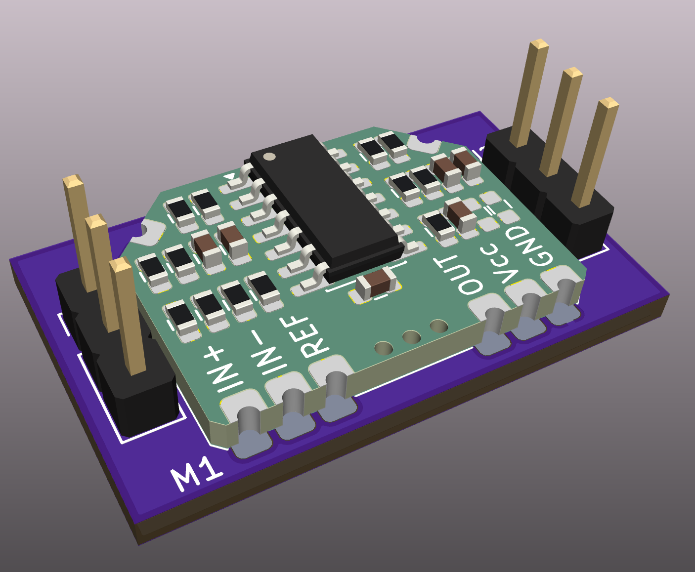
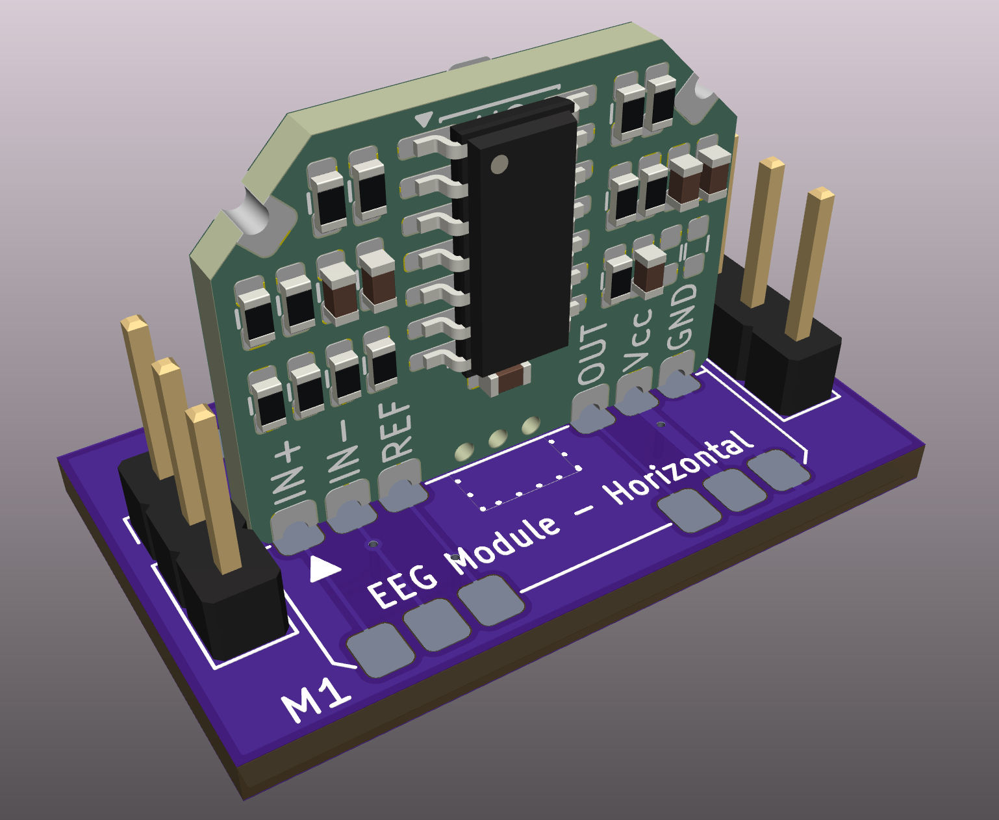
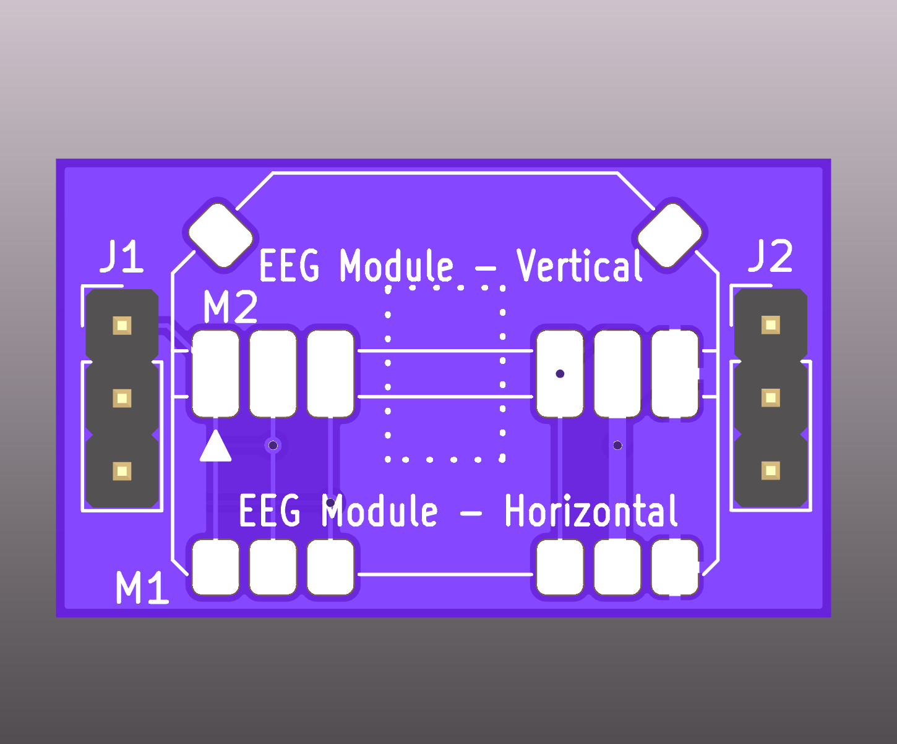
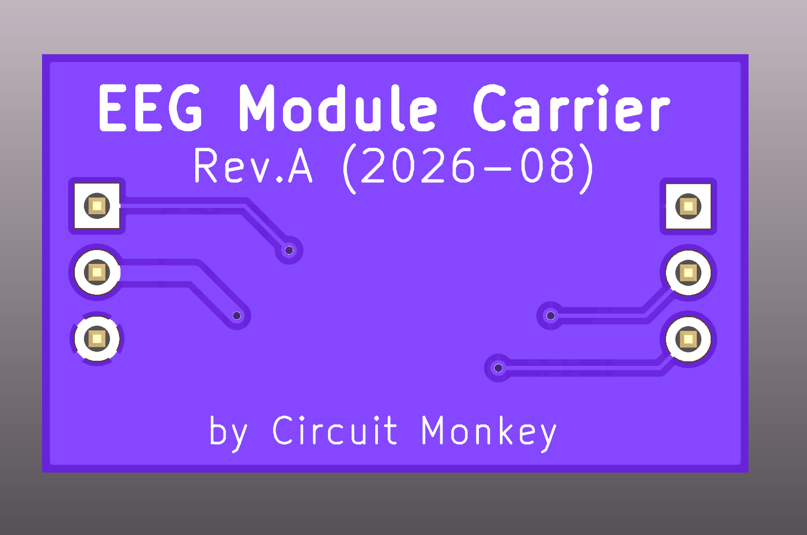

# eeg-experiments
Experiments in EEG hardware and software.

<h2>EEG Single Channel CHiPz Module</h2>
The single channel module for EEG input is designed as a SMT CHiPz module for integration into larger designs.  It features an optimized and lower cost version of the [BioAmp EXG Pill](https://www.crowdsupply.com/upside-down-labs/bioamp-exg-pill).  For our design, we removed some configuration options such that the user would opt to simply modify the components on the board for the specific purpose such as EEG/EOG/EKG/etc.

<h2>Example/Test Carrier for EEG Single Channel CHiPz Module</h2>
We made a simple carrier PCB for the single channel EEG sensor CHiPz module so that we could test it as well as its easy use in a prototyping environment.  We also made a KiCAD symbol and footprint for the module so that you can integrate the module into your own PCB designs. The CHiPz KiCAD symbol and footprint library is located in separate [GIT Hub repo](https://github.com/CircuitMonkey/kicad-library). That repo also includes many KiCAD components that we have created or tuned to be superior to the standard KiCAD components.

